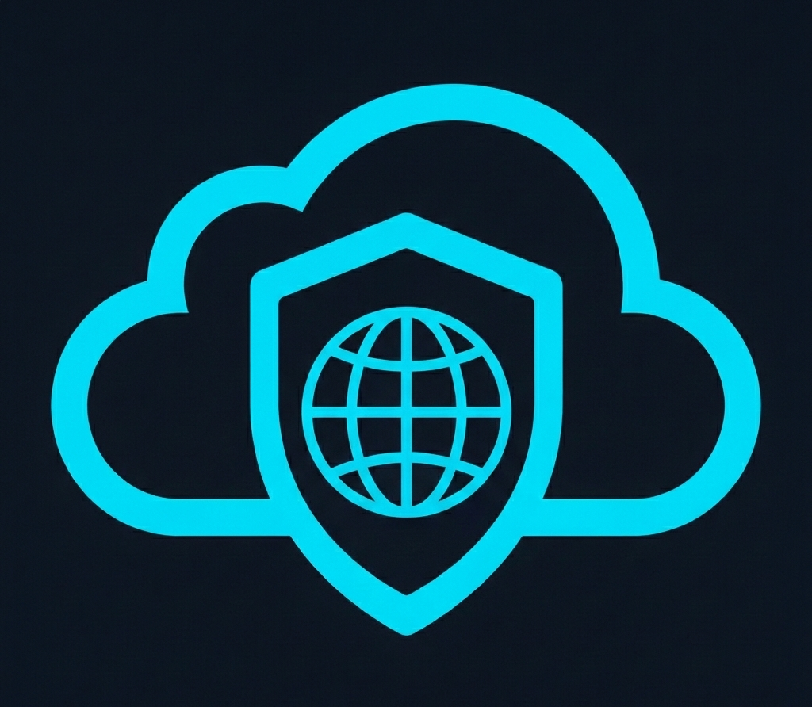
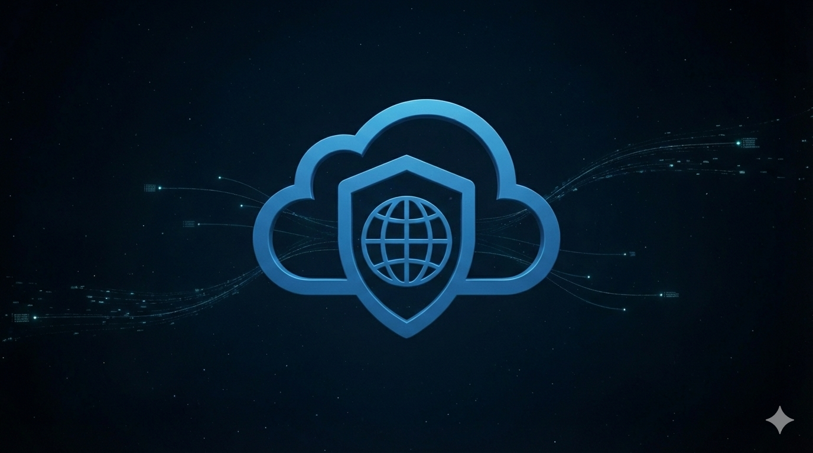
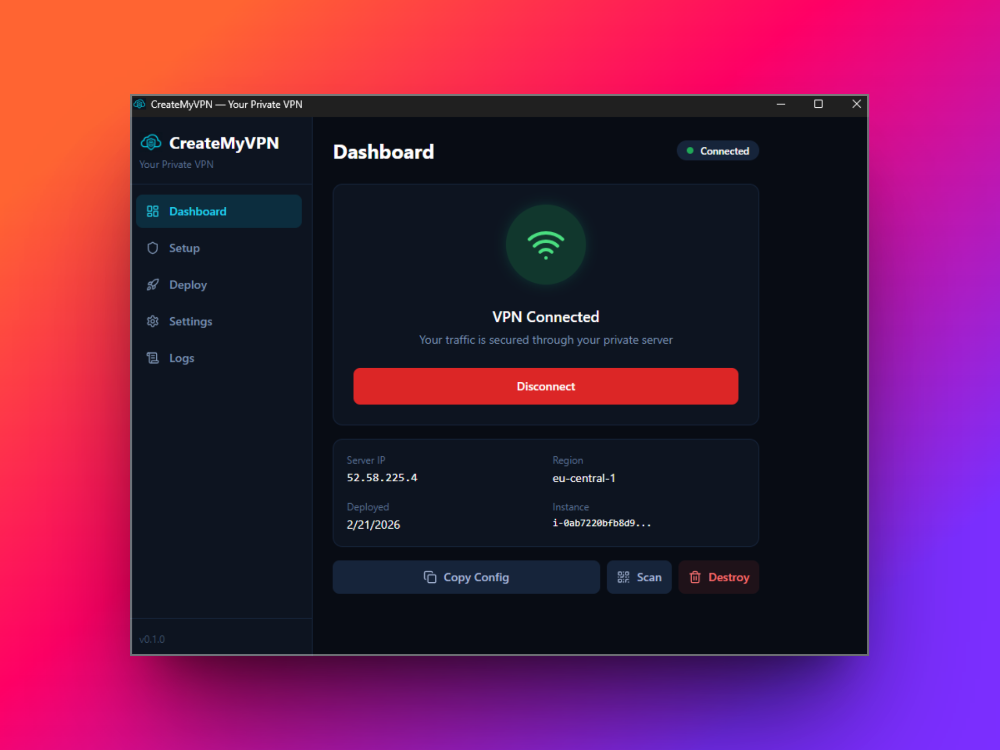

<p align="center">
  
</p>

<h1 align="center">CreateMyVPN</h1>

<p align="center">
  <strong>Deploy your private VPN in under 2 minutes — no DevOps required.</strong>
</p>

<p align="center">
  
</p>

CreateMyVPN is an open-source desktop app that lets anyone deploy, use, and destroy their own private VPN server in the cloud with a few clicks. No Terraform, no Ansible, no CLI — just a clean GUI.

**Privacy should be owned, not rented.**

## Why CreateMyVPN?

| | Commercial VPNs | Algo / Outline | CreateMyVPN |
|---|---|---|---|
| Server ownership | Company owns | You own | You own |
| IP reputation | Shared / blocked | Dedicated | Dedicated |
| Ease of use | 1-click | CLI / technical | 1-click GUI |
| Full lifecycle | N/A | Setup only | Deploy → Connect → Destroy |
| Keys | Server-side | Local (manual) | Local (automated) |
| Cost | $5–12/mo subscription | VPS cost | VPS cost (on-demand) |
| Open source | No | Yes | Yes |

## Screenshots

<p align="center">
  
</p>

<p align="center">
  
</p>

## Features

- **One-click deploy** — provisions a full VPN server (VPC, security group, instance, WireGuard) in your own cloud account
- **AWS & DigitalOcean** — choose your preferred cloud provider
- **BYO VPS** — bring your own Ubuntu server and let CreateMyVPN configure WireGuard on it
- **Auto-destroy timer** — schedule infrastructure teardown after 1h, 2h, 4h, 8h, or 24h
- **WireGuard** — modern, fast, audited VPN protocol with local key generation (keys never leave your device)
- **QR code export** — scan with WireGuard mobile app to connect your phone
- **Config file export** — download `.conf` for any WireGuard client
- **Crash-safe state** — every resource is persisted to disk so teardown always works, even after a crash
- **Dark theme UI** — clean 5-page React interface with progress tracking

## Tech Stack

| Layer | Technology |
|---|---|
| Desktop framework | [Tauri 2](https://tauri.app/) (Rust) — ~10 MB bundle |
| Frontend | React 18 + TypeScript |
| Styling | Tailwind CSS 3 |
| Cloud SDKs | AWS SDK for Rust, DigitalOcean REST API (reqwest) |
| SSH | russh (pure Rust async SSH) |
| WireGuard keys | x25519-dalek (Curve25519) |
| VPN tunnel | wg-quick (Linux) / wireguard.exe (Windows) |

## Getting Started

### Prerequisites

- [Node.js](https://nodejs.org/) 18+
- [Rust](https://rustup.rs/) (stable)
- System dependencies for Tauri — see the [Tauri prerequisites guide](https://v2.tauri.app/start/prerequisites/)

**Linux only (Ubuntu/Debian):**

```bash
sudo apt install libwebkit2gtk-4.1-dev libgtk-3-dev libayatana-appindicator3-dev \
  librsvg2-dev libssl-dev pkg-config cmake nasm
```

### Development

```bash
# Install frontend dependencies
npm install

# Run in development mode (opens app with hot reload)
npm run tauri dev
```

### Building for Release

**Windows:**

```powershell
npm run tauri build
# Output: src-tauri/target/release/bundle/
```

**Linux:**

```bash
bash scripts/build-linux.sh
```

## Project Structure

```
createmyvpn/
├── src/                        # React frontend
│   ├── pages/                  # Setup, Dashboard, Deploy, Settings, Logs
│   ├── components/             # Reusable UI components
│   ├── hooks/                  # React hooks (credentials, deployment, VPN status)
│   └── lib/                    # Types & Tauri bridge
├── src-tauri/                  # Rust backend
│   └── src/
│       ├── commands/           # Tauri IPC commands
│       ├── aws/                # AWS SDK operations
│       ├── do_cloud/           # DigitalOcean API operations
│       ├── ssh/                # SSH automation (replaces Ansible)
│       ├── wireguard/          # Key generation, config rendering, tunnel management
│       └── persistence/        # Crash-safe state store
├── .github/workflows/          # CI + Release pipelines
└── scripts/                    # Build helper scripts
```

## Cloud Account Setup

### AWS

1. Create an IAM user with `AmazonEC2FullAccess` + `AmazonSSMReadOnlyAccess`
2. Generate an access key pair
3. Paste the Access Key ID and Secret into the app's Setup page

### DigitalOcean

1. Go to **API → Generate New Token** in the DO dashboard
2. Paste the token into the app's Setup page

## How It Works

<table>
  <tr>
    <td align="center" width="33%">
      <br/>
      <strong>1. Setup</strong><br/>
      Enter your cloud credentials
    </td>
    <td align="center" width="33%">
      <br/>
      <strong>2. Deploy</strong><br/>
      Pick a region and click Deploy
    </td>
    <td align="center" width="33%">
      <br/>
      <strong>3. Connect</strong><br/>
      One click to activate your VPN
    </td>
  </tr>
</table>

All WireGuard keys are generated locally. Your private key never leaves your machine.

## CI / CD

| Workflow | Trigger | What it does |
|---|---|---|
| **CI** | Push / PR to `main` | TypeScript type-check, Vite build, `cargo fmt`, `cargo clippy`, `cargo test` |
| **Release** | Push tag `v*.*.*` | Builds Windows `.msi` + Linux `.deb`, creates a draft GitHub Release |

## License

This project is licensed under the [MIT License](LICENSE).

## Contributing

Contributions are welcome! Please open an issue first to discuss what you'd like to change.
